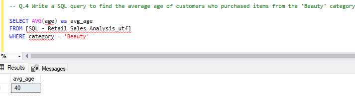
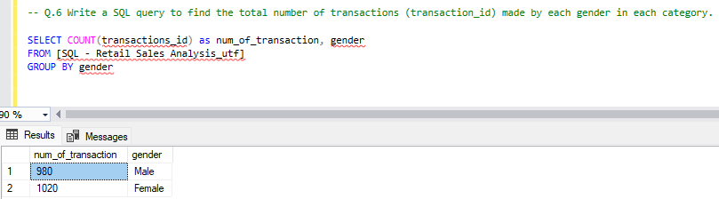
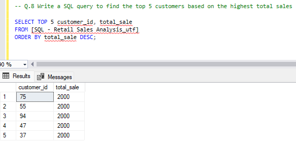

# Retail Sales Using SQL

## Project Overview
- **Project Title**: Retail Sales Using SQL
- **Objective**: This project demonstrates SQL skills and techniques typically used by data analysts to explore, clean, and analyze retail sales data.
- **Description**:  The project involves working with a retail sales database to answer key business questions through SQL queries. It covers essential SQL techniques like data filtering, aggregation, grouping, and conditional logic to draw actionable insights from the data


## SQL Query Process
1-Write a SQL query to retrieve all columns for sales made on '2022-11-05:
```sql
select sale_date 
from [SQL - Retail Sales Analysis_utf ]
where sale_date = '2022-11-05'
```


2-Write a SQL query to retrieve all transactions where the category is 'Clothing' and the quantity sold is more than 4 in the month of Nov-2022:
```sql
SELECT *
FROM [SQL - Retail Sales Analysis_utf ]
WHERE category = 'Clothing' 
  AND FORMAT(sale_date, 'yyyy-MM') = '2022-11'
  AND quantiy >= 4
```


3-Write a SQL query to calculate the total sales (total_sale) for each category:
```sql
SELECT *
FROM [SQL - Retail Sales Analysis_utf ]
WHERE category = 'Clothing' 
  AND FORMAT(sale_date, 'yyyy-MM') = '2022-11'
  AND quantiy >= 4
```


4-Write a SQL query to find the average age of customers who purchased items from the 'Beauty' category.:
```sql
SELECT AVG(age) as avg_age
FROM [SQL - Retail Sales Analysis_utf]
WHERE category = 'Beauty'
```


5-Write a SQL query to find all transactions where the total_sale is greater than 1000.:
```sql
SELECT *
FROM [SQL - Retail Sales Analysis_utf]
WHERE total_sale > 1000
```


6-Write a SQL query to find the total number of transactions (transaction_id) made by each gender in each category:
```sql
SELECT COUNT(transactions_id) as num_of_transaction, gender
FROM [SQL - Retail Sales Analysis_utf]
GROUP BY gender
```


7- Write a SQL query to calculate the average sale for each month. Find out best selling month in each year
```sql
SELECT AVG(total_sale) AS average_sale, 
       YEAR(sale_date) AS year,
       MONTH(sale_date) AS month
FROM [SQL - Retail Sales Analysis_utf]
GROUP BY YEAR(sale_date), MONTH(sale_date)
ORDER BY average_sale desc
```


8-Write a SQL query to find the top 5 customers based on the highest total sales

```sql
SELECT TOP 5 customer_id, total_sale
FROM [SQL - Retail Sales Analysis_utf]
ORDER BY total_sale DESC;
```


9-Write a SQL query to find the number of unique customers who purchased items from each category

```sql
SELECT 
    category,    
    COUNT(DISTINCT customer_id) as cnt_unique_cs
FROM [SQL - Retail Sales Analysis_utf]
GROUP BY category
```


10-Write a SQL query to create each shift and number of orders (Example Morning <12, Afternoon Between 12 & 17, Evening >17):

```sql
WITH hourly_sale AS (
    SELECT *,
        CASE
            WHEN DATEPART(HOUR, sale_time) < 12 THEN 'Morning'
            WHEN DATEPART(HOUR, sale_time) BETWEEN 12 AND 17 THEN 'Afternoon'
            ELSE 'Evening'
        END AS shift
    FROM [SQL - Retail Sales Analysis_utf]
)
SELECT 
    shift,
    COUNT(*) AS total_orders    
FROM hourly_sale
GROUP BY shift;
```


## Conclusion
This project demonstrates key SQL techniques used in retail sales data analysis, including filtering, aggregation, and working with date and time functions. By analyzing real-world data, we gain valuable insights into sales performance, customer behavior, and operational trends.
